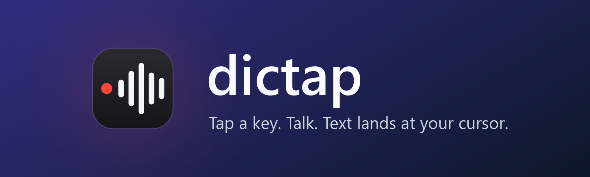
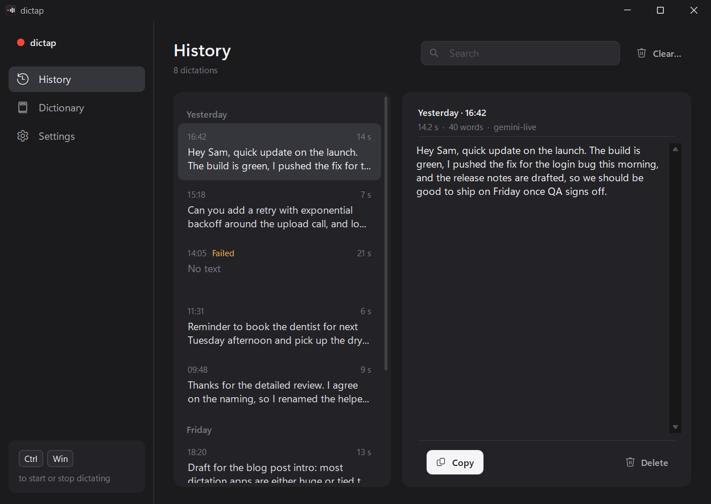
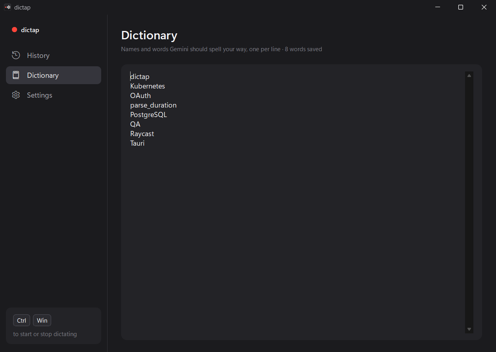
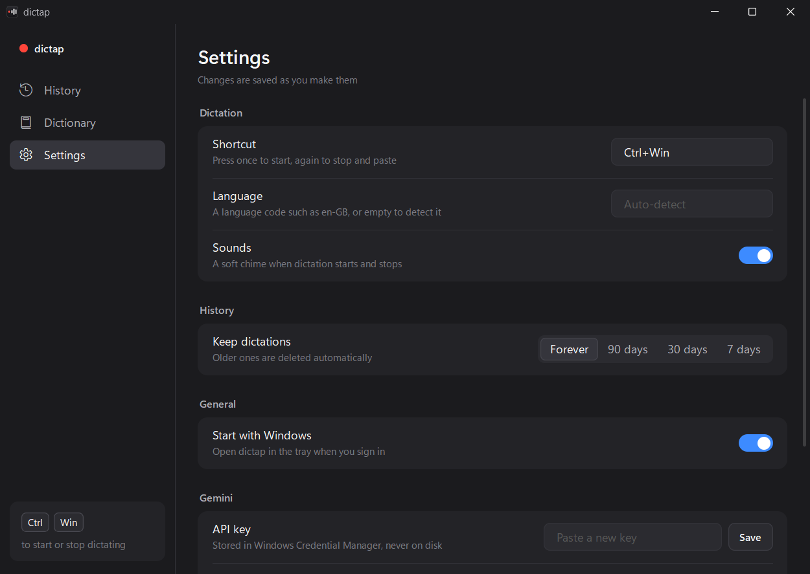

<p align="center">
  
</p>

<p align="center">
  <a href="https://github.com/strix52/dictap/releases/latest"></a>
  
  
  
  <a href="LICENSE"></a>
</p>

<p align="center">
  Press <kbd>Ctrl</kbd> + <kbd>Win</kbd>, talk, press it again. The text is pasted wherever your cursor is.<br>
  Transcription runs on a cloud API with your own key. The app itself is one 2.2 MB exe.
</p>

<p align="center">
  <a href="https://github.com/strix52/dictap/releases/latest/download/dictap.exe"><b>⬇ Download dictap.exe</b></a>
  &nbsp;·&nbsp;
  <a href="#quick-start">Quick start</a>
  &nbsp;·&nbsp;
  <a href="#scope">Scope</a>
  &nbsp;·&nbsp;
  <a href="#privacy">Privacy</a>
</p>

<p align="center">
  <a href="docs/media/dictap-promo.mp4"></a><br>
  <sub><a href="docs/media/dictap-promo.mp4">▶ Full 36 s film with sound (MP4, 6.4 MB)</a></sub>
</p>

<p align="center">
  
</p>

## Scope

dictap does one job: send your voice to a speech-to-text API and type the result. It has no local models and won't get them. Future versions may add other API providers, but the design assumes transcription happens online.

That narrow scope is why it's small. With no model runtime or browser engine to ship, it uses about 15 MB of RAM and no CPU while it waits for the hotkey.

We built it after using [OpenWhispr](https://github.com/OpenWhispr/openwhispr) only for cloud transcription. OpenWhispr does much more: local Whisper models, many providers, macOS and Linux, AI features. If you need any of that, use OpenWhispr. If cloud dictation on Windows is all you use, dictap covers it in a fraction of the footprint.

## Features

- **Live transcript.** Words show in a small overlay as you speak. Audio streams to Gemini Live; if the stream fails, the recording is uploaded instead.
- **History with Retry.** Each dictation is saved locally before it's pasted. Failed recordings are kept and can be retried with one click.
- **Copy last transcription** from the tray menu if the text did not reach your text box.
- **Clipboard left alone.** dictap pastes via the clipboard, then restores what was there when it safely can (best effort; if the clipboard changed meanwhile, your newer copy wins). Dictated text is kept out of <kbd>Win</kbd> + <kbd>V</kbd> history and cloud clipboard.
- **Custom dictionary** for names and jargon (`Kubernetes`, `PostgreSQL`).
- **Cancel** a slow transcription by pressing the hotkey twice. A countdown warns you before the 9:45 recording limit.
- **API key in Windows Credential Manager**, not in a file.
- **Per-user install, no admin.** Start menu entry (so Start search and Raycast find it), start with Windows, uninstall from Settings › Apps.
- **OpenWhispr import** of history, dictionary and API key, read-only.

<p align="center">
  
</p>

<table>
<tr>
<td width="50%"></td>
<td width="50%"></td>
</tr>
</table>

## Quick start

1. Download [`dictap.exe`](https://github.com/strix52/dictap/releases/latest/download/dictap.exe) and run it. The exe isn't code-signed yet, so SmartScreen may block it: click **More info › Run anyway**, or [build it yourself](#build-from-source).
2. Choose **Yes** to install. It goes to `%LOCALAPPDATA%\Programs\dictap` and starts.
3. In Settings, paste a Gemini API key from [Google AI Studio](https://aistudio.google.com/apikey) and click **Save**.
4. Click into a text box, press <kbd>Ctrl</kbd> + <kbd>Win</kbd>, talk, press it again.

dictap runs in the tray. Choose **No** at the install prompt, or pass `--portable`, to run it without installing.

**Update:** run the new `dictap.exe`; it replaces the installed copy and keeps your data.
**Uninstall:** Settings › Apps › Installed apps › dictap. It asks whether to keep your history and key.

## Privacy

- No dictap servers, accounts or telemetry.
- Audio goes from your PC to the provider (Google Gemini today) with your key, only while you're dictating. The microphone is closed otherwise.
- History is a local SQLite file in `%APPDATA%\dictap`. You can set it to expire after 7, 30 or 90 days.
- A recording is deleted once its transcript is confirmed complete. A live transcript is saved as *provisional* and its audio is kept (at most 20 files / 200 MiB) until you retry it. Failed recordings stay in `%LOCALAPPDATA%\dictap` until you retry or delete them.

The provider's terms apply to the audio you send. Google may use data sent on the Gemini free tier to improve its products; paid keys are excluded.

## Build from source

Needs Rust 1.88+ on Windows. The Windows SDK is optional; with it, the build embeds the icon and version info.

```powershell
git clone https://github.com/strix52/dictap
cd dictap
cargo build --release
.\target\release\dictap.exe
```

| Option | Effect |
|---|---|
| `--install [--no-launch]` | Install or update without asking |
| `--uninstall [--quiet]` | Uninstall; `--quiet` skips questions and keeps data |
| `--portable` | Run without offering to install |
| `--history`, `--dictionary`, `--settings` | Open the window on that page |

## Roadmap

- Other cloud speech-to-text providers, same bring-your-own-key model
- Signed releases and `winget install dictap`

Bugs and ideas: [Issues](https://github.com/strix52/dictap/issues).

## License

[MIT](LICENSE) © Ayush Raj
