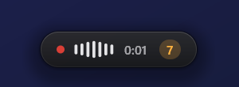
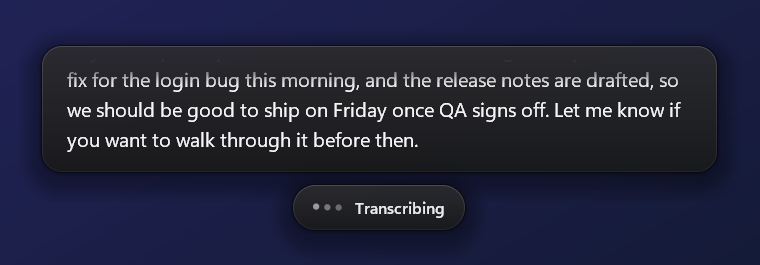

<p align="center">
  
</p>

<p align="center">
  <a href="https://github.com/strix52/dictap/releases/latest"></a>
  
  
  
  <a href="LICENSE"></a>
</p>

<p align="center">
  <b>Voice typing for Windows that stays out of your way.</b><br>
  Press <kbd>Ctrl</kbd> + <kbd>Win</kbd>, say what you mean, press again. Your words are typed wherever your cursor is:<br>
  in your editor, your chat, your email, your terminal.
</p>

<p align="center">
  <a href="https://github.com/strix52/dictap/releases/latest/download/dictap.exe"><b>⬇ Download dictap.exe</b></a>
  &nbsp;·&nbsp;
  <a href="#quick-start">Quick start</a>
  &nbsp;·&nbsp;
  <a href="#why-dictap">Why dictap</a>
  &nbsp;·&nbsp;
  <a href="#privacy">Privacy</a>
</p>

<p align="center">
  
</p>

---

## Why dictap

Talking is about three times faster than typing. A dictation tool should make that feel effortless, and the best way to be effortless is to be **invisible**: no window to manage, no fan spinning up, nothing to wait for.

dictap started as a replacement for [OpenWhispr](https://github.com/OpenWhispr/openwhispr), which we used every day. It worked, but it was a full Electron app: hundreds of megabytes of RAM and a big install for something that spends 99% of its life waiting for a hotkey. So we rebuilt the idea from scratch, natively, with one rule: **it should cost nothing when you're not using it and feel instant when you are.**

<table>
<tr>
<td width="33%" valign="top">

### 🪶 Tiny
One **2.2 MB** exe. About **15 MB** of RAM and **0% CPU** while idle. No Electron, no Python, no runtime to install. Plain Rust talking straight to Win32.

</td>
<td width="33%" valign="top">

### ⚡ Live
Your words appear in a small floating card **while you're still talking**, streamed as you speak. When you stop, the text is pasted in about the time it takes to lift your finger.

</td>
<td width="33%" valign="top">

### 🛟 Never loses a word
Every dictation is saved to local history first, then pasted. If the network drops, the recording is kept and a **Retry** button is one click away.

</td>
</tr>
</table>

## Features

- **One hotkey, anywhere.** <kbd>Ctrl</kbd> + <kbd>Win</kbd> to start, again to stop. Change it in Settings. Works in any app that accepts typing.
- **Live transcript overlay.** A calm capsule with a live waveform and timer, plus a card that shows the words as they're recognised. Older lines fade out so it never grows into a wall of text.
- **Streaming first, with a safety net.** Audio streams to a live transcription model as you talk. If that fails, dictap quietly falls back to uploading the recording, so you still get your text.
- **Polite clipboard.** dictap pastes through the clipboard, then **puts back whatever you had copied before**. The dictated text is marked private, so it doesn't pile up in <kbd>Win</kbd> + <kbd>V</kbd> history or sync to your other devices.
- **Searchable history.** Every dictation, with duration, word count and one-click Copy. Choose to keep it forever, or for 90, 30 or 7 days.
- **Custom dictionary.** Teach it the names, products and jargon it should spell your way: `Kubernetes`, `PostgreSQL`, your colleague's name.
- **Recording limit you can see.** Long dictations show a gentle countdown before the limit (just under 10 minutes), instead of silently cutting you off.
- **Cancel anytime.** Stuck on a slow network? Press the hotkey twice while it says *Transcribing* to give up; the audio stays in history for later.
- **Language: auto or yours.** Auto-detect by default, or pin a language code such as `en-GB`.
- **Your key, stored properly.** The API key lives in **Windows Credential Manager**, never in a plain file.
- **Installs itself, no admin.** Run the exe once and it offers to install into your user profile, with a Start menu entry (so it shows up in Start search, Raycast and other launchers), start-with-Windows, and a normal uninstall entry in Settings › Apps.
- **Coming from OpenWhispr?** Import your history, dictionary and API key in one click from Settings. OpenWhispr's own files are only ever read, never changed.

## A look inside

<p align="center">
  
</p>

<table>
<tr>
<td width="50%"></td>
<td width="50%"></td>
</tr>
<tr>
<td align="center"><sub><b>Dictionary</b>: words it should always spell your way</sub></td>
<td align="center"><sub><b>Settings</b>: everything on one calm page</sub></td>
</tr>
</table>

<table>
<tr>
<td width="50%" align="center"></td>
<td width="50%" align="center"></td>
</tr>
<tr>
<td align="center"><sub>A countdown before the recording limit</sub></td>
<td align="center"><sub>Finishing up after you stop talking</sub></td>
</tr>
</table>

## dictap and OpenWhispr

OpenWhispr is a good, feature-rich open-source app, and it inspired this one. They make different trade-offs:

| | **dictap** | **OpenWhispr** |
|---|---|---|
| Built with | Rust + plain Win32 | Electron (Chromium + Node.js) |
| Download | **2.2 MB**, one exe | Full installer |
| On disk | **2.2 MB** | 782 MB app folder, plus ~1 GB of downloaded runtimes and models (on our machine) |
| Memory while idle | **~15 MB** | Hundreds of MB |
| Platforms | Windows 10 and 11 | **Windows, macOS, Linux** |
| Offline / local models | Not yet | **Yes** (local Whisper) |
| Transcription providers | Google Gemini today, more planned | **Many** |

**Pick dictap** if you're on Windows and want something tiny, fast and invisible that you forget is running.
**Pick OpenWhispr** if you need macOS or Linux, fully offline transcription, or its wider set of providers and AI features.

## Quick start

1. **Download** [`dictap.exe`](https://github.com/strix52/dictap/releases/latest/download/dictap.exe) and run it.
   > Windows SmartScreen may warn you because the exe isn't code-signed yet. Click **More info › Run anyway**. You can always [build it yourself](#build-from-source) instead.
2. Choose **Yes** to install. dictap copies itself to `%LOCALAPPDATA%\Programs\dictap`, adds itself to the Start menu and starts. No admin rights needed.
3. **Add your API key.** Settings opens for you. Paste a Gemini API key (you can create one for free at [Google AI Studio](https://aistudio.google.com/apikey)) and click **Save**.
4. Click into any text box, press <kbd>Ctrl</kbd> + <kbd>Win</kbd>, and talk. Press <kbd>Ctrl</kbd> + <kbd>Win</kbd> again to finish.

That's it. dictap lives in the system tray; right-click it for History, Settings, start-with-Windows and Quit.

> **Just want to try it?** Choose **No** at the install prompt to run it once from wherever it is, or start it with `dictap.exe --portable`.

### Updating

Download the new `dictap.exe` and run it. It offers to replace your installed copy and keeps your history, settings and key.

### Uninstalling

**Settings › Apps › Installed apps › dictap › Uninstall**, like any other app. It asks whether to keep your history and key in case you come back.

## Privacy

dictap has **no servers, no accounts, no telemetry and no analytics**. It never phones home.

- **Audio** goes straight from your PC to the transcription provider (today, Google's Gemini API), using **your own key**, and only while you're dictating. The microphone is closed the rest of the time.
- **History** stays on your machine, in a local SQLite database under `%APPDATA%\dictap`. Delete one entry, clear it all, or let it expire automatically.
- **Recordings** are kept only while a dictation is in progress. If a transcription fails, the recording is kept under `%LOCALAPPDATA%\dictap` so you can retry it, and removed when you delete that entry.
- **Your API key** is kept in Windows Credential Manager and only ever sent to the provider.

The provider's own terms apply to what you send them. For Gemini, note that Google may use data sent on its free tier to improve its products; a paid key avoids that.

## Build from source

You need [Rust](https://rustup.rs) (stable, 1.88 or newer) on Windows. The Windows 10/11 SDK is optional: with it, the build embeds the app icon and version info.

```powershell
git clone https://github.com/strix52/dictap
cd dictap
cargo build --release
.\target\release\dictap.exe
```

The release profile is tuned for size (`opt-level = "z"`, fat LTO, stripped), which is how the whole app fits in about 2 MB.

<details>
<summary><b>Command-line options</b></summary>

| Option | What it does |
|---|---|
| `--install` | Install (or update) this copy without asking, then start it. Add `--no-launch` to skip starting. |
| `--uninstall` | Uninstall. Add `--quiet` to skip the questions (keeps your data). |
| `--portable` | Run this copy without offering to install it. |
| `--history`, `--dictionary`, `--settings` | Open the app window on that page. |

</details>

## Roadmap

dictap talks to Gemini today, but it isn't tied to it. On the list:

- More transcription providers, bring-your-own-key
- Local, offline transcription
- Signed releases and `winget install dictap`

Ideas and bug reports are welcome in [Issues](https://github.com/strix52/dictap/issues).

## License

[MIT](LICENSE) © Ayush Raj
